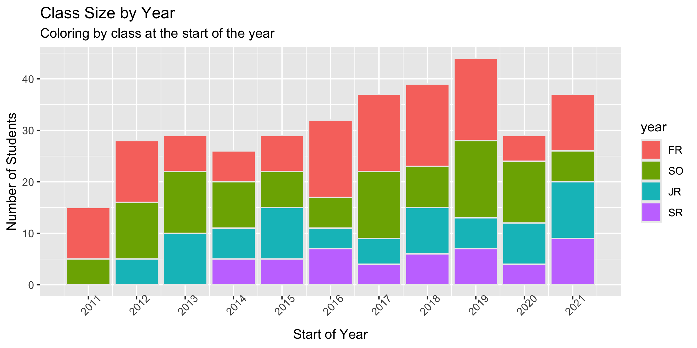
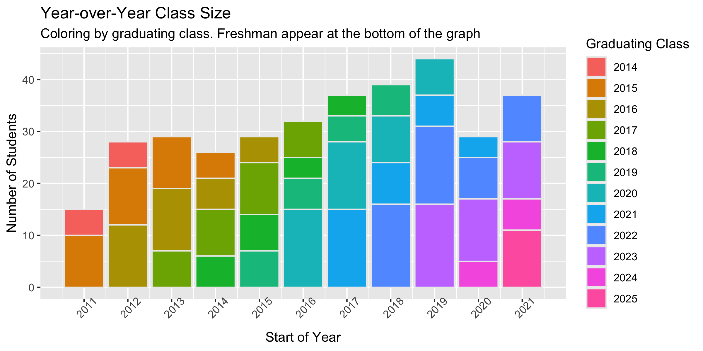
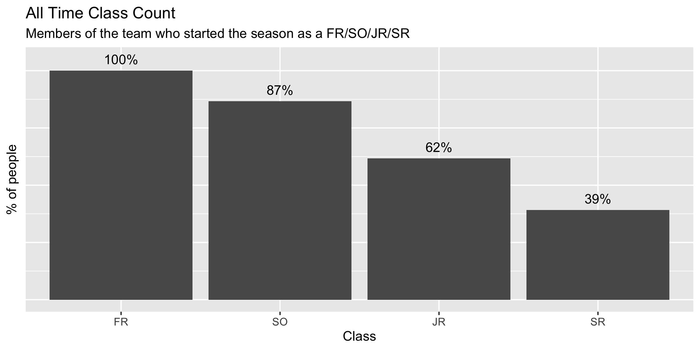

# Attrition







## Appendix

Data is from the Carnegie Mellon rosters on [SwimCloud].

### Todo list

- [x] scrape a single page
- [x] scrape a list of pages
- [x] gather data in a single dataframe
- [x] plot class size per year colored by class
- [x] plot attrition lines per class

### Running the scrape yourself

> Assumes you already have [npm] installed


```
npm ci
npm run scrape
```

This should fill up the `data/` directory with files

```bash
$ tree data/
data/
├── 2011.csv
├── 2012.csv
├── 2013.csv
├── 2014.csv
├── 2015.csv
├── 2016.csv
├── 2017.csv
├── 2018.csv
├── 2019.csv
├── 2020.csv
└── 2021.csv
```

## Plotting

> Assume you already have [R] installed

```
npm run plot
```

Will generate the plots in the `plots` directory:

```bash
$ tree plots/
plots
├── all-time-class-count.png
├── class-attrition-by-year.png
├── class-proportion-by-year.png
├── class-size-by-year.png
├── relative-class-proportion-by-year.png
└── relative-class-size-by-year.png
```

<!-- Links -->
[SwimCloud]: https://www.swimcloud.com/team/33/roster/?page=1&gender=M&season_id=15&sort=name
[npm]: https://nodejs.org/en/docs/meta/topics/dependencies/#npm
[R]: https://www.r-project.org/
